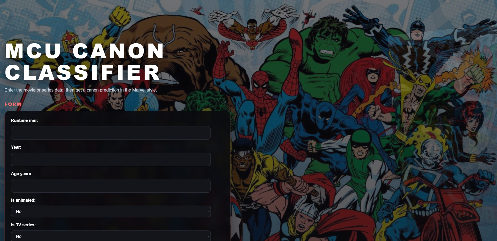

# MCU-Canon-Classifier

Predicting whether a Marvel movie or TV series belongs to the official Marvel Cinematic Universe (MCU) canon, based on metadata, ratings, financials, and genre signals — served through a FastAPI backend and a Django frontend.



## Problem Statement

Marvel's catalog spans MCU films, Netflix Marvel series, Sony/Spider-Man productions, and decades of Pre-MCU adaptations (TV movies, animated series, 1940s serials). Telling canon from non-canon at a glance isn't always obvious from title alone. This project trains a classification model on merged metadata (cast, ratings, RAG-style summaries, and a master catalog) to predict whether a given title is part of official MCU continuity, and serves predictions through a FastAPI service and a Django front end.

## Features Used

| Feature | Description |
|---|---|
| Runtime (min) | Movie/episode runtime |
| Year | Release year |
| Age (years) | Years since release |
| Budget (log) | Production budget, log-transformed |
| Revenue (log) | Revenue, log-transformed |
| Box Office (log) | Box office gross, log-transformed |
| Popularity | TMDB popularity score |
| IMDb / Metacritic / Rotten Tomatoes / TMDB | Critic and audience ratings, normalized to a 0–10 scale |
| Type | Movie or series |
| Rated | Age/content rating (PG, PG-13, TV-MA, etc.) |
| Decade | Release decade (one-hot) |
| Status | Production status (Released, Ended, Returning Series, etc.) |
| Genre (multi-label) | Action, Comedy, Sci-Fi, Horror, etc. — synonym-normalized across IMDb/TMDB sources |
| Is Animated / Is TV Series / Is TV Movie Format | Structural format flags |

**Excluded by design:** `universe_*` and `mcu_phase_*` were dropped after EDA confirmed they directly encode the target (data leakage) — including them would let the model "cheat" instead of learning generalizable patterns. Row `id` was also dropped after feature-importance review revealed it was leaking row-order information.

## Model Performance

| Metric | Value |
|---|---|
| Algorithm | XGBoost Classifier |
| Best params | `learning_rate=0.05, max_depth=4, n_estimators=100` |
| F1 (5-fold CV) | 0.83 |
| F1 (calibrated threshold, CV) | 0.84 |
| Decision threshold | 0.30 (tuned via `cross_val_predict`, default 0.5 undershot recall for the canon class) |
| Accuracy (hold-out) | 0.79–0.82 |

Model selection was benchmarked against Logistic Regression and Random Forest via stratified 5-fold cross-validation before tuning; XGBoost gave the best F1 with an acceptable variance across folds.

## Project Structure

```
MCU-Canon-Classifier/
├── api/
│   ├── app.py                        <-- (FastAPI main file)
│   ├── requirements.txt
│   └── Dockerfile
├── machine-learning/
│   ├── data/
│   │   ├── raw-data/
│   │   │   ├── raw-marvel-cast.csv
│   │   │   ├── raw-marvel-master.csv
│   │   │   ├── raw-marvel-rag.csv
│   │   │   └── raw-marvel-ratings.csv
│   │   ├── cleaned-data/
│   │   │   └── cleaned-data.csv
│   │   └── processed-data/
│   │       └── processed-data.csv
│   ├── models/
│   │   └── model.pkl                 <-- (trained model + threshold + feature names)
│   ├── notebooks/
│   │   ├── EDA.ipynb
│   │   ├── FE.ipynb
│   │   └── MT.ipynb
│   └── src/
│       ├── utils.py
│       ├── EDA.py
│       ├── FE.py
│       └── MT.py
├── app/
│   ├── app/                          <-- (Django project settings)
│   ├── templates/
│   │   └── index.html
│   ├── static/
│   │   ├── css/style.css
│   │   └── js/script.js
│   ├── manage.py
│   ├── .gitignore 
│   ├── .env
│   ├── requirements.txt
│   └── Dockerfile
├── .gitignore
├── docker-compose.yml
├── preview.png
└── README.md
```

## Tech Stack

- **ML:** Python, Pandas, NumPy, Scikit-learn, XGBoost
- **API:** FastAPI, Uvicorn, Pydantic, joblib
- **Web:** Django, HTML, CSS, JavaScript
- **Infra:** Docker, Docker Compose

## Getting Started

### 1. Clone the repository
```bash
git clone https://github.com/<your-username>/MCU-Canon-Classifier.git](https://github.com/Chumus2/MCU-Canon-Classifier.git
cd MCU-Canon-Classifier
```

### 2. Configure environment variables
Copy the example file and fill in your own values:
```bash
cp .env.example .env
```

### 3. Run with Docker
```bash
docker compose up --build
```

### 4. Open in browser
- **Web App:** http://localhost:8000
- **API Docs:** http://localhost:8001/docs

## API Documentation

FastAPI auto-generates interactive docs at:

http://localhost:8001/docs

`POST /predict` accepts a JSON body of movie/series features and returns:
```json
{
  "is_mcu_canon": 1,
  "probability": 0.7421,
  "threshold_used": 0.3
}
```

## How to Use

1. Open http://localhost:8000 in your browser.
2. Fill in the title's details:
   - Runtime, release year, budget/revenue/box office (log-scaled)
   - Popularity, IMDb/Metacritic/Rotten Tomatoes/TMDB ratings
   - Format flags — animated, TV series
3. Click **Submit for Review**.
4. Get the model's ruling — **Canon** or **Not Canon** — along with a confidence score.

## Methodology Notes

- **Data merging:** Four raw sources (cast, master catalog, RAG summaries, ratings) were joined on `(title, year)` — the only key shared across all four tables — since cast and ratings carry one row per actor/source and required aggregation (`groupby` + `pivot_table`) before merging.
- **Leakage checks:** Correlation heatmaps against the target flagged `universe_MCU` at a perfect 1.00 correlation, and `id` at unexpectedly high feature importance — both were removed before finalizing the model.
- **Threshold calibration:** Rather than using scikit-learn's default 0.5 cutoff, the decision threshold was tuned via `cross_val_predict` across the full dataset, improving F1 by roughly 7 points by favoring recall on the canon class.
